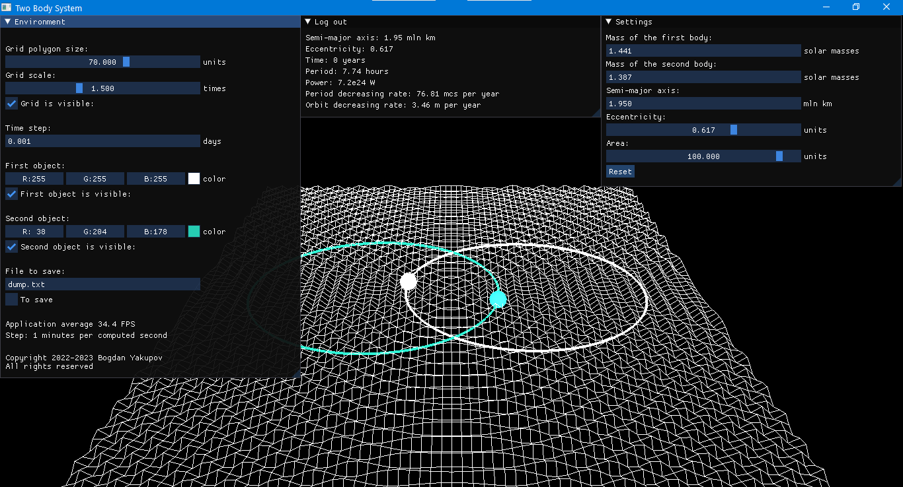
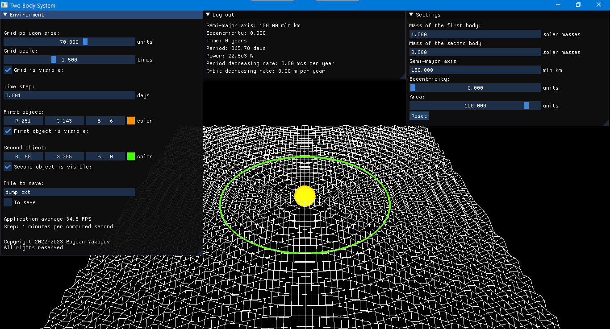

A research project, 2022-2023.
Student: Bogdan Yakupov.
Mentor: Artem Moskalenko. 
Kazakhstan, Kostanay.

The program models and demonstrates a process of evolution of a two-body system with an arbitrary eccentricity in real time. The process of evolutions considers only gravitational waves emission which is found to be sufficient enough to lead the whole system to change and give accurate estimations.

Using the middle window, the program displays power emitted by gravitational waves, period of rotation of bodies, eccentricity change, semi-major axis change, time passed since evolution of a two-body system has begun, period decreasing rate, and orbit decreasing rate.

The right window is to set variables of a two-body system:
1. Masses of the first and second bodies;
2. Semi-major axis;
3. Eccentricity;
4. Area to locate the binary on.

The left window is to change environment behavior and properties:
1. Grid polygon size;
2. Grid scale;
3. Grid visibility;
4. Time step for modelling;
5. The first and second objects properties;
6. File to save outcomes within dump directory.

Program has been verified using Hulse-Taylor binary system.

Control is on WASD and a right mouse button. 
Setup is available on Windows.

Copyright 2022-2023 Bogdan Yakupov. All rights reserved.

Illustrations:

